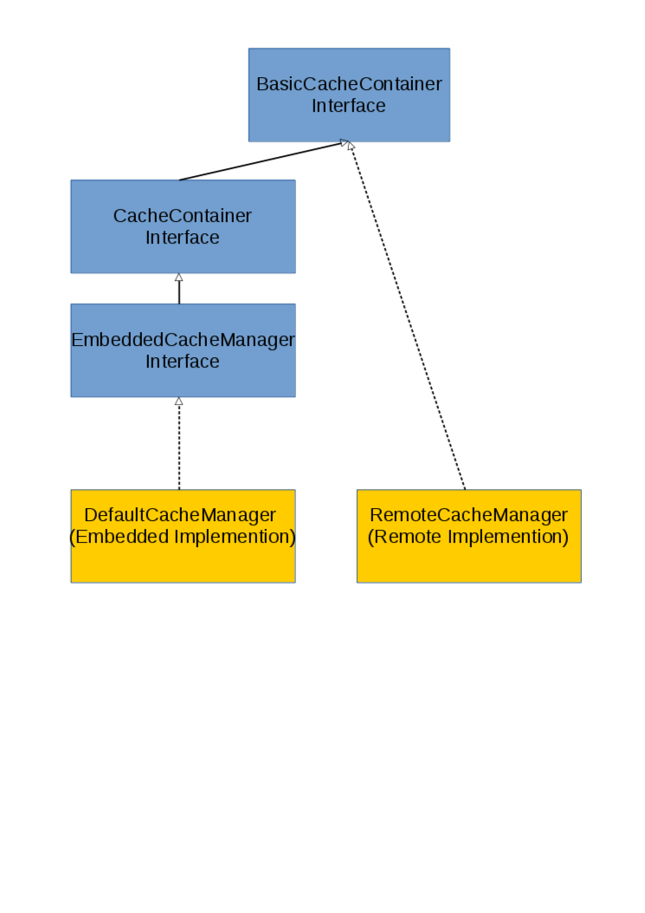
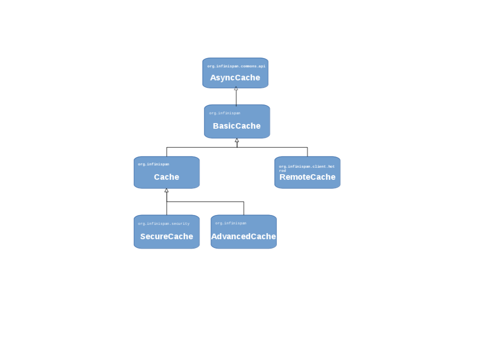

# JBoss JDG 6.0 Workshop

Infinispan:: _Infinispan is a distributed in-memory key/value data store and can be used both as an embedded Java library and as a language-independent service accessed remotely over a variety of protocols (HotRod, REST, Memcached and WebSockets)_ 

== JDG API

**Note:** JDG API does not have a direct Infinisan community version and it has as a basis Infinispn 6 but with several patches from version 7 on top.

### CacheManager

A CacheManager is the primary mechanism for retrieving a Cache instance, and is often used as a starting point to using the Cache. CacheManagers are heavyweight objects, and we foresee no more than one CacheManager being used per JVM (unless specific configuration requirements require more than one; but either way, this would be a minimal and finite number of instances). Once constructed, CacheManagers should be made available to any component that requires a Cache, via JNDI or via some other mechanism such as an IoC container.

https://docs.jboss.org/infinispan/7.2/apidocs/org/infinispan/commons/api/BasicCacheContainer.html[BasicCacheContainer Interface]::

* extended by https://docs.jboss.org/infinispan/7.2/apidocs/org/infinispan/manager/CacheContainer.html[CacheContainer Interface]
* extended by https://docs.jboss.org/infinispan/7.2/apidocs/org/infinispan/manager/EmbeddedCacheManager.html[EmbeddedCacheManager Interface] All implementations of _EmbeddedCacheManager_ are a CacheManager that runs in the same JVM as the client.

https://docs.jboss.org/infinispan/7.2/apidocs/org/infinispan/manager/DefaultCacheManager.html[DefaultCacheManager]:: It implements the _EmbeddedCacheManager_. It is used for access of JDG _Caches_ in **Library(Embedded) Mode** and its constructors can take in a Configuration or a path or URL to a configuration XML file. _Lifecycle_ - CacheManagers have a lifecycle (it implements link:https://docs.jboss.org/infinispan/7.2/apidocs/org/infinispan/commons/api/Lifecycle.html[Lifecycle]) and the default constructors also call _DefaultCacheManager.start()_. When the system shuts down, it should call _DefaultCacheManager.stop()_ on the CacheManager to also ensure all caches within its scope are properly stopped as well.

https://docs.jboss.org/infinispan/7.2/apidocs/org/infinispan/client/hotrod/RemoteCacheManager.html[RemoteCacheManager]:: Is used to gain access to _RemoteCache_, the _RemoteCacheManager_ must be started first: beside other things, this instantiates connections to Hot Rod server(s). Starting the _RemoteCacheManager_ can be done either at creation by passing _start==true_ to constructor or by using a constructor that does that for you; or after construction by calling _RemoteCacheManager.start()_. This is an "expensive" object, as it manages a set of persistent TCP connections to the Hot Rod servers. It is recommended to only have one instance of this per JVM, and to cache it between calls to the server (i.e. remoteCache operations). _RemoteCacheManager.stop()_ needs to be called explicitly in order to release all the resources (e.g. threads, TCP connections).

**Library Mode**
With link:http://infinispan.org/docs/7.2.x/user_guide/user_guide.html#_server_modules[Infinispan in Library (Embedded) mode] _CacheManager_ libraries co-exist with the user application in the same JVM whilst also application and cache data  share the JVM space. There are http://infinispan.org/docs/7.2.x/user_guide/user_guide.html#_why_use_embedded_mode[reasons for and against] using this P2P mode but mainly it offers quick change over another technology, transactions whilst giving away flexibility of linear extensibility.

**Client-Server Mode**
With link:http://infinispan.org/docs/7.2.x/user_guide/user_guide.html#_server_modules[Infinispan in Client-Server mode] the _CacheManager_ configuration is provided from a Server with HotRod, REST and MemCache as the current server implementations. Focusing on HotRod specific configurations to reach a remote _CacheManager_ is performed by passing standard HotRod client properties via properties parameter. The remote servers referenced must be running and able to receive the request. If not specified the default address and port will be used (127.0.0.1:11222).  

### Cache

link:https://docs.jboss.org/infinispan/7.2/apidocs/[Cache]:: Is the central interface of Infinispan. It is based on the following hierarchy (ConcurrentMap is not shown) of interfaces and as with _CacheManger_ there are 2 types of Cache Interfaces (_Remote_, _Embedded_) which extend the _BasicCache_

link:https://access.redhat.com/documentation/en-US/Red_Hat_JBoss_Data_Grid/6.6/html-single/Developer_Guide/index.html#chap-JSR-107_JCache_API[JCache]::

* JCache Embedded: _CachingProvider.getCacheManager(file_location)_
* JCache Remote:   _CachingProvider.getCacheManager_. In addition, contrary to Library mode, the first time a cache reference is obtained _CacheManager.createCache_ must be used so that the cache may be registered internally. Subsequent queries may be performed via _CacheManager.getCache_.

Spring Cache:: TBD
CDI Cache:: TBD

##### LABS

###### Lab 1 - JDG Cache in Library (Embedded Mode)
* Pre-Requisites
** Download and unzip the Maven Repository for the relevant (at the time of writing JDG 6.6) JDG Version.
** set the maven with a profile for the unzipped repository (eg link:../example-settings.xml[example-settings.xml])
 
* Lab Tasks
We start with a simple JDG Embedded Setup Labe (link:../JdgLibraryWorkshopSetup1[JdgLibraryWorkshopSetup1]). Here we simply create a cache based on embedded JDG libraries and a default non-clustered configuration. Execute the application by running the `Main class. Observe the output. Why is the thread not exiting? Can you fix it?
----
Compile: mvn clean compile
Run:     mvn exec:java -Dexec.mainClass="org.jboss.skousou.jdg.workshop.Main"
----

** TO BE REMOVED ** : https://access.redhat.com/documentation/en-US/Red_Hat_JBoss_Data_Grid/6.6/html-single/Getting_Started_Guide/index.html#chap-Run_Red_Hat_JBoss_Data_Grid_in_Library_Mode_Multi-Node_Setup[Run Red Hat JBoss Data Grid in Library Mode (Multi-Node Setup)]

######  LAB 2: JDG Cache in Client Server Mode. 

Ideas from: https://access.redhat.com/documentation/en-US/Red_Hat_JBoss_Data_Grid/6.6/html-single/Getting_Started_Guide/index.html#chap-Run_Red_Hat_JBoss_Data_Grid_in_Remote_Client-Server_Mode [Run Red Hat JBoss Data Grid in Remote Client-Server Mode]

* Pre-Requisites
** Download and unzip the Maven Repository for the relevant (at the time of writing JDG 6.6) JDG Version.
** set the maven with a profile for the unzipped repository (eg link:../example-settings.xml[example-settings.xml])
** Download and unzip the JDG Server for the relevant (at the time of writing JDG 6.6) JDG Version.

== GRID TOPOLOGIES
ON CLUSTERED::
* LOCAL

CLUSTERED::
* REPLICATION
* DISTRIBUTION (PARTIONED)
* INVALIDATION

Hashwheel and Consistency Algorithms will go later

##### LABS
3. LAB 3: JDG cache in different modes

== CONFIGURATION

Configure CacheManager and Caches (configuration, server configuration)::
* Set Up JVM Memory Management
** Set Up Eviction
** Set Up Expiration (Combined LAB??)
* Set Up Locking for the Cache
*  Locking (LAB??)
*  Set Up Lock Striping
* Set Up the L1 Cache
**Embedded
**Remote **(LAB)** Near Caching

##### LABS
4. LAB 4: Eviction/Expiration
5. LAB 5: L1 Cache(Embedded)/Near Caching(Remote)

== MONITOR JDG CacheManager and Cache
* CLI
* JCONSOLE
* MBEANS
* JON

== day 2
* Marshalling (Embedded vs Client-Server, StorebyValue/StorebyReference) 
* Hashwheel (algorithms)
* State Transfer
* Cache Warmup (including CacheStores, WriteThrough/WriteBehind)
* Security: 

== day 3
* JGroups (stack, toll to monitor JGroups etc.)
* Partition Handling, Split Brain Syndrome
* Transactions

